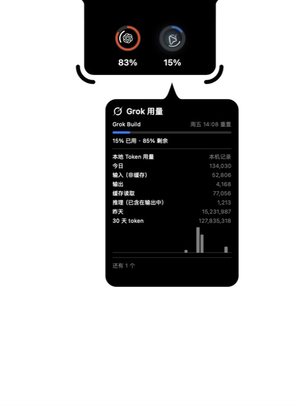

# Codenotch 中文定制版

本仓库是 [Vinz 的 Codenotch](https://github.com/vinzdg/codenotch) 的**非官方衍生版**。
原项目提供应用框架、屏幕边缘刘海、额度圆环、动画和会话提醒；本仓库新增简体中文，以及参考
[Tokei](https://github.com/cclank/tokei) 统计口径的 **Claude Code / Codex / Grok 每日 Token 用量**。
统计模块在本仓库用 Swift 实现，未打包 Tokei 采集器。

原作者版权、MIT 许可证和 Git 历史均予以保留；新增代码沿用 MIT 许可证。
详细关系见 [来源与致谢](ATTRIBUTION.md)。本版本由本仓库维护，不代表两个原项目的官方发行版。

## 使用

1. 从[本仓库的 Releases](https://github.com/chencujinlin/codenotch/releases/latest) 下载 ZIP，解压后将 `Codenotch.app` 放入“应用程序”目录并打开。点击刘海齿轮或按 `⌘,` 进入设置。
2. 在 **外观 → 语言 → 简体中文** 中选择中文，也可跟随系统。
3. 打开 **Token 用量**：选择账户和日期，查看精确总量、非缓存输入、输出、缓存读取和缓存写入。
4. 切换近 7 天／近 30 天查看趋势；点击日期查看当日明细，页面下方显示模型用量。

将鼠标移到 Grok 额度圆环上，弹窗会在每周额度下显示今日 Token 分类、昨日用量及近 30 天总量和趋势。

当前源码构建的 Grok 弹窗实机截图：



页面打开时每 30 秒自动刷新，也可手动刷新。读取日志无需额外登录，额度圆环继续使用上游的数据来源。

## 数据来源与口径

| 工具 | 本地记录 | 合计方式 |
| --- | --- | --- |
| Claude Code | `~/.claude/projects/**/*.jsonl`，包含子 Agent | 输入 + 输出 + 缓存读取 + 缓存写入 |
| Codex | `~/.codex/sessions/**/*.jsonl` 和 `archived_sessions/**/*.jsonl` | 原始输入 + 输出；缓存和推理不重复累加 |
| Grok Build | `${GROK_HOME:-~/.grok}/logs/unified.jsonl` 中逐调用 Token 记录 | 原始输入 + 输出；缓存从输入拆出，推理作为输出子项 |

支持 `~/.claude-*`、`~/.codex-*` 多配置目录，以及启动进程传入的 `CLAUDE_CONFIG_DIR` / `CODEX_HOME`。
Grok 支持 `GROK_HOME` 指定日志根目录。Finder 启动通常不会继承终端的环境变量。

统计按本机时区归入每天，处理重复快照、归档副本，以及有父会话标识的 Codex 分叉历史。
没有日志时显示“未找到记录”；部分记录损坏或无法读取时标明历史不完整。

这里只统计本机可读日志。其他设备、Claude 网页／桌面聊天及已删除的日志可能不在其中。
Token 包含反复处理的上下文和缓存，不等于手动输入的文字数，也不等于订阅账单费用。
当前新增统计针对 Claude Code、Codex 和 Grok Build；Tokei 的费用估算、跨设备同步和其他工具统计尚未移植。
Grok 按每次模型调用的时间归入日期，支持每日明细、模型统计和 7／30 天趋势；旧版没有 Token 字段的日志标记为历史不完整，不用上下文快照估算。
详细规则见 [统计说明](docs/daily-token-usage.md)。

## 本地构建

需要 macOS 15+、Python 3 和 Swift；首次构建需联网下载项目原有依赖。
这台开发机器使用 Command Line Tools 及其附带的 macOS 26.5 SDK，无需完整 Xcode：

```sh
python3 Scripts/build-local.py               # 输出 build/Codenotch.app
python3 Scripts/build-local.py --tokens-only # 独立运行 Token 统计测试
```

本地包使用独立标识 `com.local.codenotch`，采用临时签名，停用上游自动更新以保留定制功能。
它不是上游签名或公证的发行版。构建脚本不会安装到“应用程序”目录。

完整 Xcode 环境仍可使用原有工作流：

```sh
brew install xcodegen
make build
make test
make run
```

原项目介绍和贡献规范见 [README.md](README.md) 和 [CONTRIBUTING.md](CONTRIBUTING.md)。
